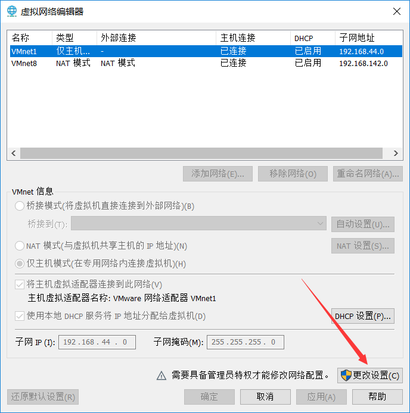

# 桌面云搭建

## 实验目的

- 初步了解虚拟化技术，理解云计算的相关概念
- 理解系统工程师面临的困境
- 理解自动化安装、管理（DevOps）在云应用中的重要性

## 实验环境与要求

- 用户通过互联网，使用微软远程桌面，远程访问你在PC机上创建的虚拟机
- 虚拟机操作系统 Centos，Ubuntu，或 你喜欢的 Linux 发行版，能使用 NAT 访问外网。

## 实验内容

### 安装 VMware

**安装过程略，这里简单的说下怎么设置 NAT 模式**

点击编辑里面的虚拟网络编辑器，若已存在 NAT 模式则可以直接使用，若不存在则点击更改设置




添加网络，后设置为 NAT 模式，修改下面子网 IP 地址为 192.168.xxx.0，xxx 可以为你想要的任意的，我这里设置的为 142，子网掩码设置为 255.255.255.0，确定


命令行执行 ipconfig 查看是否有 VMware 网卡


### 使用远程桌面连接虚拟机

**我这里以我使用的虚拟机为例，如何搭建远程桌面**
**安装虚拟机过程很容易，这里不多赘述**

安装 xrdp

```sh
#安装xrdp
 sudo apt-get install xrdp
 #安装vnc4server
 sudo apt-get install vnc4server tightvncserver
 #安装xubuntu-desktop
 sudo apt-get install xubuntu-desktop xfce4
 #向xsession中写入xfce4-session
 echo "xfce4-session" >~/.xsession
 #开启xrdp服务
 sudo service xrdp restart
```

一切准备完毕后

```sh
netstat -anltp
# 若 3389 3350 5910 端口已开启，说明服务安装完成
```


```sh
ifconfig
# 查看 ip 地址
```


远程桌面连接


输入用户名密码


连接成功


### ssh 连接虚拟机

安装 ssh


22端口开启说明安装成功


使用 MobaXterm 连接


连接成功


### 在实验室中连接寝室的虚拟机云桌面

我们最终目的是建立云桌面，在实验室中连接桌面云，我们可以把虚拟机的 ip 段 192.168.142.0 看作一个内网，学校所使用的内网段为 172 段，那么如何在实验室连接宿舍电脑上的虚拟机呢？

我们需要做的是将 虚拟机 192.168.xxx.xxx 的 3389 端口映射出去
在这里我以我的极路由做例子，如果直接接网线使用 inode 认证的可以略去路由器中的端口转发那一步

首先通过主机windows的端口转发将虚拟机的3389端口映射到主机的3390端口

```cmd
netsh interface portproxy add v4tov4 listenaddress="0.0.0.0" listenport=3390 connectaddress="192.168.142.130"  connectport=3389
```


此时我们可以直接通过访问 任意的主机网卡 ip :3390 来连接，比如我们 ipconfig 看一下


该 ip 是我路由器分配的 ip 地址，我们远程桌面连接，连接成功


如果你使用的校园网 Wifi，则可以在实验室直接连接校园内网 ip 连接远程桌面了
因为我这里使用的为 极路由，所以我还需要配置一下极路由的端口转发

打开极路由控制页面，点击互联网下面的超级端口转发，上面的 ip 为校园内网 ip，也就是在实验室连接的 ip 地址，点击下面的添加规则


三者分别对应为：实验室远程桌面访问的端口，内部端口号，以及主机的 ip 地址，主机 ip 地址通过 ipconfig 可以看到


点击保存后，我们就可以通过内网段来直接进行远程桌面连接


经过多次端口转发，不太稳定，这里还是建议主机直接连接校园内网在实验室进行连接

ssh 与远程桌面同理