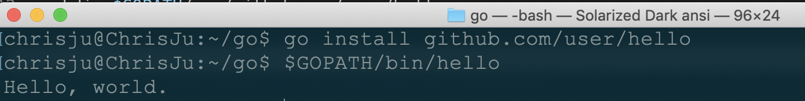
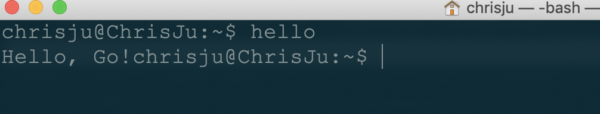
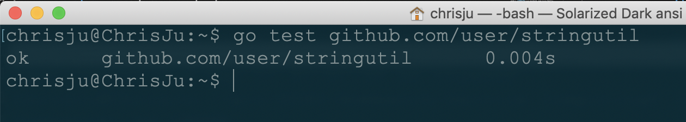

# homework3

**mac安装 go 环境很简单，这里就不一一说明了，需要注意的是，使用 vscode 安装插件时遇到网络问题，存在科学上网问题，这里去github仓库手动clone下来然后 git install 安装即可**

## Hello World

**第一个程序**
要编译并运行简单的程序，首先要选择包路径（我们在这里使用 github.com/user/hello），并在你的工作空间内创建相应的包目录

```sh
mkdir $GOPATH/src/github.com/user
mkdir $GOPATH/src/github.com/user/hello
```

接着，在该目录中创建名为 hello.go 的文件，其内容为以下Go代码：

```go
package main

import "fmt"

func main() {
  fmt.Printf("Hello, world.\n")
}
```

使用 go 工具构建并安装此程序，然后输入它的完整路径来运行它



**第一个库**

编写一个库，并让 hello 程序来使用它  
第一步还是选择包路径（我们将使用 github.com/user/stringutil） 并创建包目录：

```sh
mkdir $GOPATH/src/github.com/user/stringutil
```

接着，在该目录中创建名为 reverse.go 的文件，内容如下：

```go
// stringutil 包含有用于处理字符串的工具函数。
package stringutil

// Reverse 将其实参字符串以符文为单位左右反转。
func Reverse(s string) string {
	r := []rune(s)
	for i, j := 0, len(r)-1; i < len(r)/2; i, j = i+1, j-1 {
		r[i], r[j] = r[j], r[i]
	}
	return string(r)
}
```

使用 go build 命令来测试该包的编译

```sh
go build github.com/user/stringutil
```

确认 stringutil 包构建完毕后，修改原来的 hello.go 文件去使用它

```go
package main

import (
	"fmt"

	"github.com/user/stringutil"
)

func main() {
	fmt.Printf(stringutil.Reverse("!oG ,olleH"))
}
```

无论是安装包还是二进制文件，go 工具都会安装它所依赖的任何东西。 因此当我们通过
```sh
go install github.com/user/hello
```
来安装 hello 程序时，stringutil 包也会被自动安装。

现在工作空间是这样
```
bin/
	hello                 # 可执行命令
pkg/
	linux_amd64/          # 这里会反映出你的操作系统和架构
		github.com/user/
			stringutil.a  # 包对象
src/
	github.com/user/
		hello/
			hello.go      # 命令源码
		stringutil/
			reverse.go       # 包源码
```

因为环境变量中 $GOPATH/bin 已加入环境变量，所以直接运行 hello ，输入



**测试**

Go拥有一个轻量级的测试框架，它由 go test 命令和 testing 包构成。

你可以通过创建一个名字以 _test.go 结尾的，包含名为 TestXXX 且签名为 func (t *testing.T) 函数的文件来编写测试。 测试框架会运行每一个这样的函数；若该函数调用了像 t.Error 或 t.Fail 这样表示失败的函数，此测试即表示失败。

我们可通过创建文件 $GOPATH/src/github.com/user/stringutil/reverse_test.go 来为 stringutil 添加测试，其内容如下：

```go
package stringutil

import "testing"

func TestReverse(t *testing.T) {
	cases := []struct {
		in, want string
	}{
		{"Hello, world", "dlrow ,olleH"},
		{"Hello, 世界", "界世 ,olleH"},
		{"", ""},
	}
	for _, c := range cases {
		got := Reverse(c.in)
		if got != c.want {
			t.Errorf("Reverse(%q) == %q, want %q", c.in, got, c.want)
		}
	}
}
```

测试，结果如下



