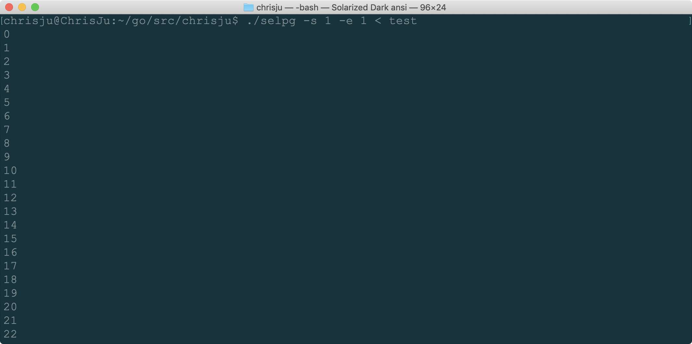
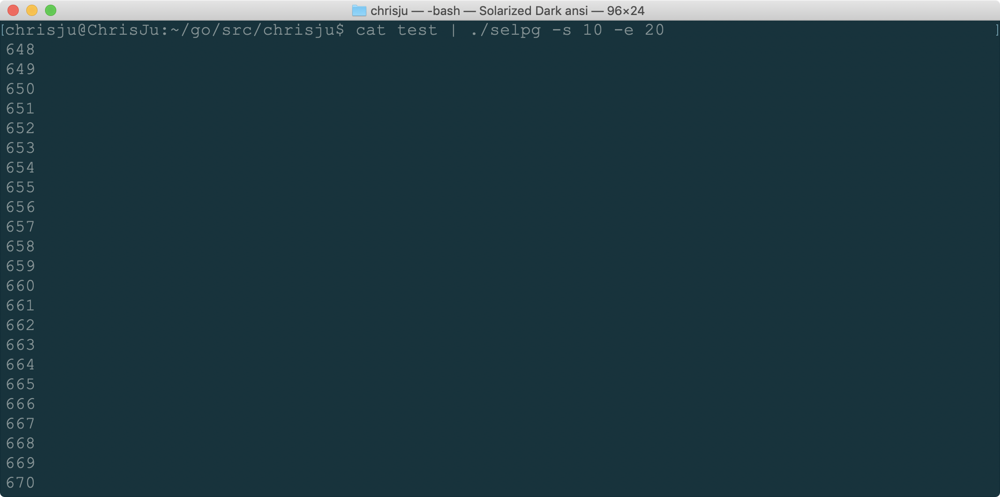
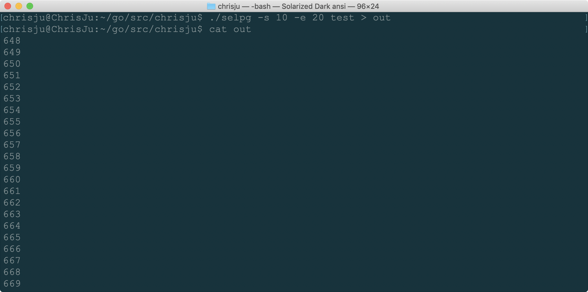
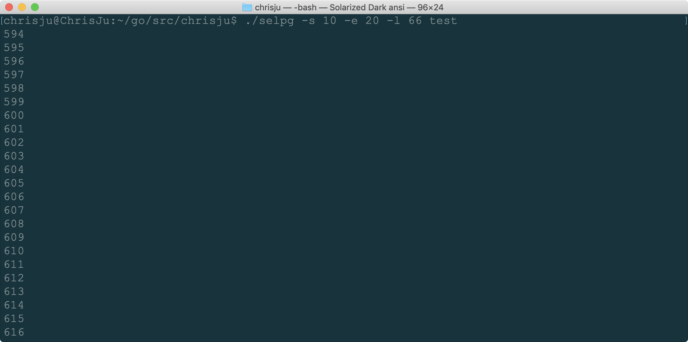
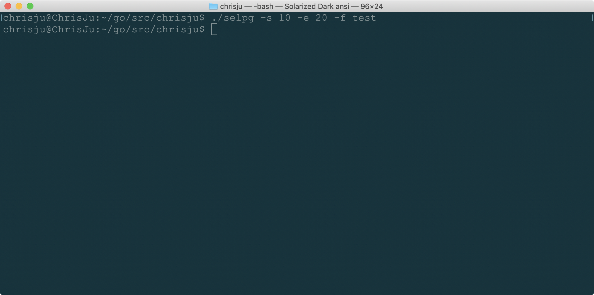

# 使用 golang 开发 开发 Linux 命令行实用程序 中的 selpg

## flag 处理参数

```go
  flag.IntVar(&parg.startPage, "s", -1, "Input start page.")
	flag.IntVar(&parg.endPage, "e", -1, "Input end page.")
	flag.IntVar(&parg.pageLine, "l", 72, "Input line number per page.")
	flag.BoolVar(&parg.pageType, "f", false, "Determine form-feed-delimited.")
	flag.StringVar(&parg.printDest, "d", "", "Input sApecify the printer.")
	flag.Parse()

	args := flag.Args()
	if len(args) > 0 {
		parg.filename = string(args[0])
	} else {
		parg.filename = ""
  }
```

## 管道处理 lp 等

```go
  var errDest error
  cmd := exec.Command(parg.printDest)
  foutDest, errDest = cmd.StdinPipe()
  if errDest != nil {
    fmt.Fprintf(os.Stderr, "\n[Error]fout_dest:")
    panic(errDest)
  }

  cmd.Stdout = os.Stdout
  cmd.Stderr = os.Stderr
  errStart := cmd.Start()
  if errStart != nil {
    fmt.Fprintf(os.Stderr, "\n[Error]command-start:")
    panic(errStart)
  }
```

```sh
selpg -s 1 -e 1 test
```


```sh
selpg -s 1 -e 1 test
```



```sh
cat test | selpg -s 10 -e 20
```




```sh
selpg -s 10 -e 20 test > out
```



```sh
selpg -s 10 -e 20 -l 66 test
```



```sh
selpg -s 10 -e 20 -f test
# 因文件中无换页符，所以输出为空
```



## 代码实现

```go
package main

import (
	"bufio"
	"flag"
	"fmt"
	"io"
	"os"
	"os/exec"
)

type selpgArgs struct {
	startPage int
	endPage   int
	filename  string
	pageLine  int
	pageType  bool
	printDest string
}

var progname string

func initParse(parg *selpgArgs) {
	flag.IntVar(&parg.startPage, "s", -1, "Input start page.")
	flag.IntVar(&parg.endPage, "e", -1, "Input end page.")
	flag.IntVar(&parg.pageLine, "l", 72, "Input line number per page.")
	flag.BoolVar(&parg.pageType, "f", false, "Determine form-feed-delimited.")
	flag.StringVar(&parg.printDest, "d", "", "Input sApecify the printer.")
	flag.Parse()

	args := flag.Args()
	if len(args) > 0 {
		parg.filename = string(args[0])
	} else {
		parg.filename = ""
	}
}

func processArgs(parg *selpgArgs) {

	if (parg.startPage <= 0) || (parg.endPage <= 0) || (parg.startPage > parg.endPage) {
		fmt.Fprintf(os.Stderr, "\n[Error]The startPage or endPage is invalid!\n\n")
		os.Exit(1)
	}
}

func processInput(parg *selpgArgs) {
	var fin *os.File
	var fout *os.File
	var foutDest io.WriteCloser

	if parg.filename == "" {
		fin = os.Stdin
	} else {
		var errFin error
		fin, errFin = os.Open(parg.filename)

		if errFin != nil {
			fmt.Fprintf(os.Stderr, "\n[Error]inputFile:")
			panic(errFin)
		}
	}

	if len(parg.printDest) == 0 {
		fout = os.Stdout
		line_index := 0
		page_index := 1
		buf := bufio.NewReader(fin)

		for true {
			line, err := buf.ReadString('\n')
			if parg.pageType {
				line, err = buf.ReadString('\f')
			}
			if err == io.EOF {
				break
			}
			if err != nil {
				fmt.Fprintf(os.Stderr, "\n[Error]file_in_out:")
				panic(err)
			}

			line_index++
			if line_index > parg.pageLine {
				page_index++
				line_index = 1
			}
			if (page_index >= parg.startPage) && (page_index <= parg.endPage) {
				fmt.Fprintf(fout, "%s", line)
			}
		}
	} else {
		var errDest error
		cmd := exec.Command(parg.printDest)
		foutDest, errDest = cmd.StdinPipe()
		if errDest != nil {
			fmt.Fprintf(os.Stderr, "\n[Error]fout_dest:")
			panic(errDest)
		}

		cmd.Stdout = os.Stdout
		cmd.Stderr = os.Stderr
		errStart := cmd.Start()
		if errStart != nil {
			fmt.Fprintf(os.Stderr, "\n[Error]command-start:")
			panic(errStart)
		}

		ling_index := 0
		page_index := 1
		buf := bufio.NewReader(fin)

		for true {
			line, err := buf.ReadString('\n')
			if parg.pageType {
				line, err = buf.ReadString('\f')
			}
			if err == io.EOF {
				break
			}
			if ling_index > parg.pageLine {
				page_index++
				ling_index = 1
			}
			if (page_index >= parg.startPage) && (page_index <= parg.endPage) {
				foutDest.Write([]byte(line))
			}
		}
	}
}

func main() {
	var args selpgArgs
	initParse(&args)
	processArgs(&args)
	processInput(&args)
}
```

