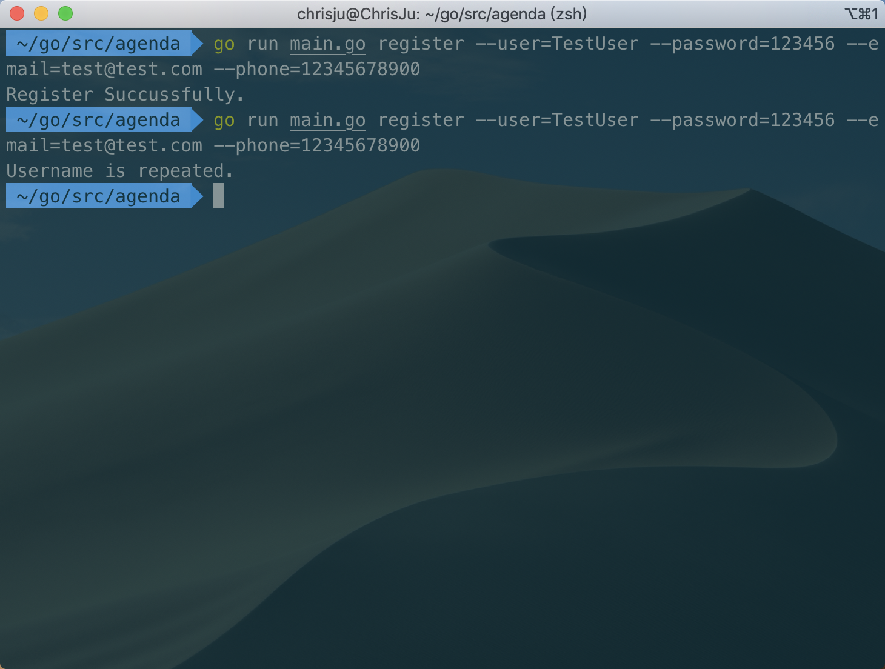
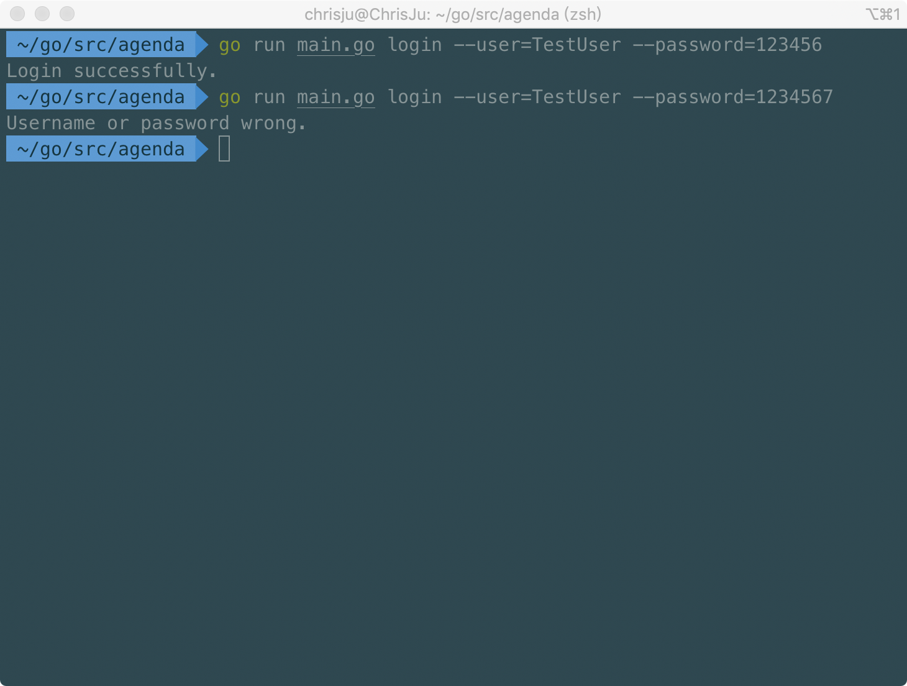

# CLI 命令行实用程序开发实战 - Agenda

## 前期准备

**安装 cobra**

```sh
go get -v github.com/spf13/cobra/cobra
```

遇到错误

```sh
Fetching https://golang.org/x/sys/unix?go-get=1
https fetch failed: Get https://golang.org/x/sys/unix?go-get=1: dial tcp 216.239.37.1:443: i/o timeout
```

解决方案

```sh
cd $GOPATH/golang.org/x/
git clone https://github.com/golang/sys.git
git clone https://github.com/golang/text.git
go install github.com/spf13/cobra/cobra
```

验证是否安装成功

```sh
cobra -h
```

## agenda 开发

### cobra 建立项目

```sh
mkdir $GOPATH/src
cd $GOPATH/src
cobra init --pkg-name=agenda
```

生成了目录

```
agenda
|
|─── LICENSE
|─── main.go
└─── cmd
      └─── root.go
```

编写 register 以及 login 命令

```sh
cobra add register
cobra add login
```

### 编写 register

获取参数，以及对参数进行判断
```go
  username, _ := cmd.Flags().GetString("user")
  password, _ := cmd.Flags().GetString("password")
  phone, _ := cmd.Flags().GetString("phone")
  email, _ := cmd.Flags().GetString("email")
  if username == "Anonymous" {
    fmt.Println("Username is required.")
    os.Exit(0)
  } else if password == "empty" {
    fmt.Println("Password is required.")
    os.Exit(0)
  } else if phone == "empty" {
    fmt.Println("Phone is required.")
    os.Exit(0)
  } else if email == "empty" {
    fmt.Println("Email is required.")
    os.Exit(0)
  }
```

读文件
```go
func readFile() []User {
	var user []User
	filePtr, err := ioutil.ReadFile("data.json")
	if err != nil {
		fmt.Println("Load data Failed, err=", err)
		os.Exit(1)
	}
	err = json.Unmarshal(filePtr, &user)
	if err != nil {
		fmt.Println("Unserilize Failed, err=", err)
		os.Exit(1)
	}
	return user
}
```

写文件
```go
func writeFile(user []User) {
	data, err := json.Marshal(user)
	err = ioutil.WriteFile("data.json", data, 0644)
	if err != nil {
		fmt.Println("Write data Failed, err=", err)
		os.Exit(2)
	}
}
```

判断用户名是否重复
```go
for _, user := range data {
  if user.Username == username {
    fmt.Println("Username is repeated.")
    return
  }
}
```

## 编写 login

```go
username, _ := cmd.Flags().GetString("user")
password, _ := cmd.Flags().GetString("password")
if username == "empty" {
  fmt.Println("Username is required.")
  os.Exit(0)
} else if password == "empty" {
  fmt.Println("Password is required.")
  os.Exit(0)
}
data := readFile()
for _, user := range data {
  if user.Username == username && user.Password == password {
    fmt.Println("Login successfully.")
    os.Exit(0)
  }
}
fmt.Println("Username or password wrong.")
```

## 测试

注册


登录




[项目地址](http://139.9.57.167:20080/share/bmjdnsu76kvs669u1v9g?secret=false)
