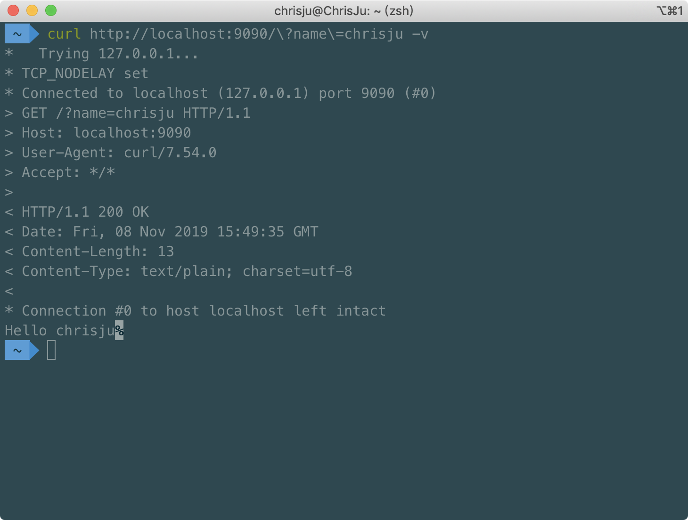
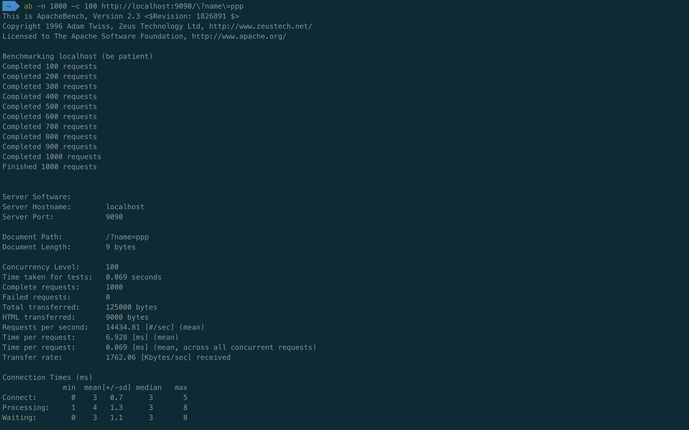

# Go 语言开发 web 服务程序

代码

```go
package main

import (
	"fmt"
	"log"
	"net/http"
	"strings"
)

func sayhelloName(w http.ResponseWriter, r *http.Request) {
	r.ParseForm()
	var name string
	for k, v := range r.Form {
		if k == "name" {
			name = strings.Join(v, "")
		}
	}
	fmt.Fprintf(w, "Hello "+name)
}

func main() {
	http.HandleFunc("/", sayhelloName)
	err := http.ListenAndServe(":9090", nil)
	if err != nil {
		log.Fatal("ListenAndServe: ", err)
	}
}
```

测试



压力测试
