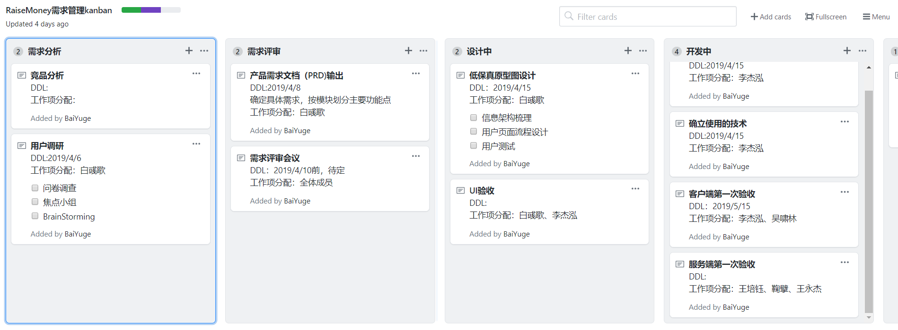
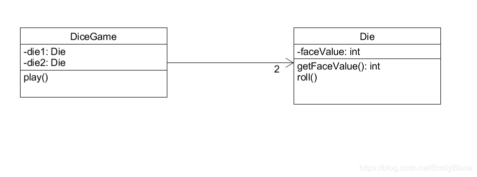

# Homework2

## 简答题

### 用简短的语言给出对分析、设计的理解。

- 分析和设计都是用于工程上的建模。
- 分析强调的是对问题和需求的调查研究，而不是解决方案
- 设计强调的是满足需求的概念上的解决方案，而不是其实现

### 用一句话描述面向对象的分析与设计的优势。

- 优化了面向结构分析与设计遇到的需求不断变化的问题，从不稳定的需求中，分析出稳定的工程对象，通过设计对象的功能和属性来达到完成去求的目标。

### 简述 UML（统一建模语言）的作用。考试考哪些图？

- UML：Unified Model Language 统一建模语言，通过构建UML图，构建软件架构层次，分析对象。构建复杂系统的模型，利用图像的直观性，简便化了理解系统的过程。可用于对系统的理解、设计、浏览、配置、维护和信息控制，适用于各种软件开发方法、软件生命周期的各个阶段、各种应用领域以及各种开发工具，是一种总结了以往建模技术的经验并吸收了当今优秀成果的标准建模方法。
- 考试考：用例图，类图，包图，状态图，交互图，活动图，构件图，部署图等

### 从软件本质的角度，解释软件范围（需求）控制的可行性

- 使用软件主要是为了优化重复的过程，从重复的过程中总结一般规律，解决实际问题。通过编写软件，来达到提升解决问题的效率。软件能够解决的问题是有限的，并不能解决生活中所有的问题。一般软件不能实现的功能，就限制了需求。

## 项目管理实践

- 看板使用练习（提交看板执行结果贴图，建议使用 Git project）
  - 使用截图工具（png格式输出），展现你团队的任务 Kanban
  - 每个人的任务是明确的。必须一周后可以看到具体结果
  - 每个人的任务是1-2项
  - 至少包含一个团队活动任务

- UML绘图工具练习（提交贴图，必须使用 UMLet）
  - 请在 参考书2 或 教材 中选择一个类图（给出参考书页码图号）

