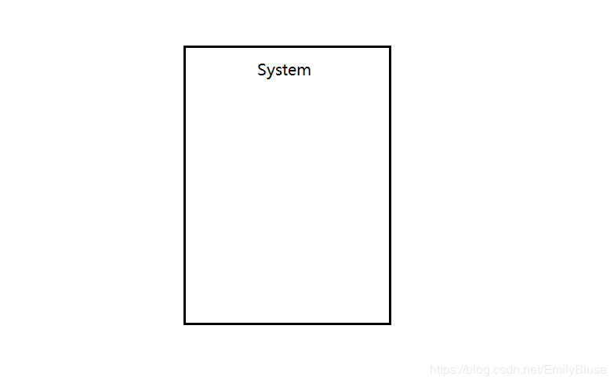
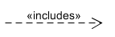
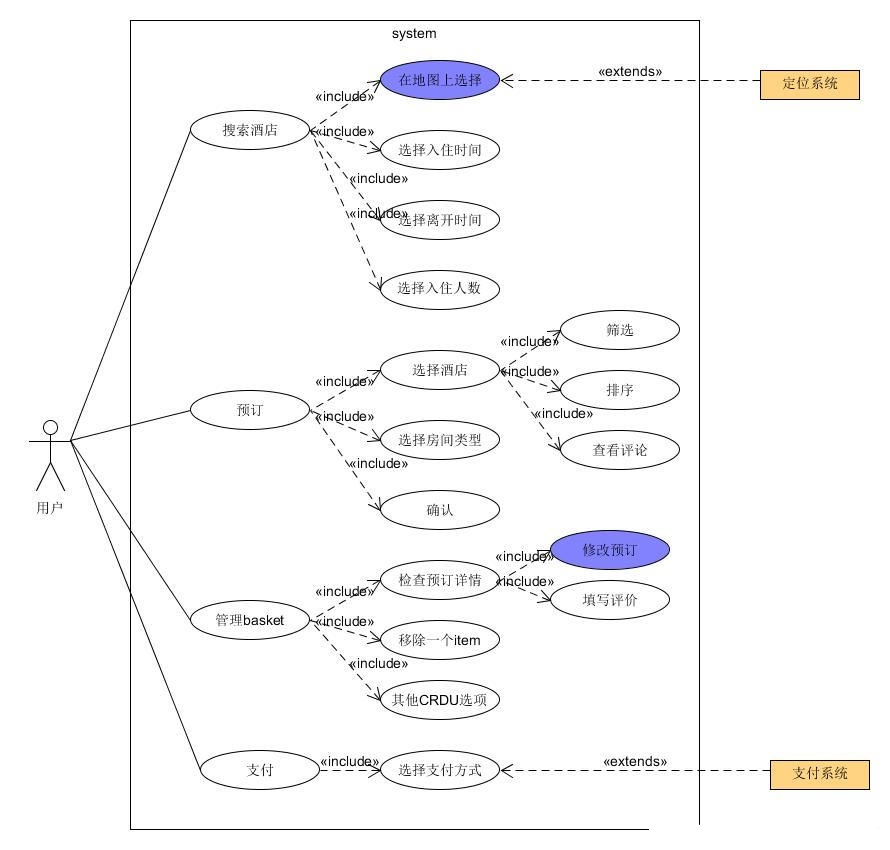

## 简答题

- 用例的概念
  - 用例（英语：use case），或译使用案例、用况，是软件工程或系统工程中对系统如何反应外界请求的描述，是一种通过用户的使用场景来获取需求的技术。每个用例提供了一个或多个场景，该场景说明了系统是如何和最终用户或其它系统互动，也就是谁可以用系统做什么，从而获得一个明确的业务目标。编写用例时要避免使用技术术语，而应该用最终用户或者领域专家的语言。用例一般是由软件开发者和最终用户共同创作的。
- 用例和场景的关系？什么是主场景或 happy path？
  - 场景是actors和系统之间特定的一系列动作和绘画，是用例的实例。一个用例是一些场景的集合。
  - 主场景（基本流）对应系统的主要的交互，通常是“成功”的场景。主场景是最常用的，能直接地实现用户目标的流程。
  - 主成功场景或happy path是用例从触发事件开始，一步一步执行，最终满足用例利益的步骤集合
  - 主成功场景应该包括以下信息：
    - 两个执行者之间的交互。如，用户提交了订单。
    - 为保证主成功场景得以继续的确认。如，系统确认用户密码。
    - 主成功场景推进过程中的内部变化。如，系统扣除用户账户余额。
- 用例有哪些形式？
  - 摘要：简洁的一段式概要，通常用于主成功场景。在早期需求分析过程中，为快速了解主题和范围，通常花费少量时间快速编写。
  - 非正式形式：非正式的段落格式，用几个段落覆盖不同的场景。
  - 详述：详细编写所有步骤和各种变化，同时具有补充部分，如前置条件和成功保证。确定并以摘要形式编写大量用例后，在第一次需求讨论中，详细地编写其中少量的具有重要架构意义和高价值的用例。
- 对于复杂业务，为什么编制完整用例非常难？
  - 复杂业务的场景较多，场景较为复杂。在前期的考虑中，很难不遗漏一些业务条件和需求，且这些需求条件还可能发生变化。所以对于复杂业务，编制完整用例且不遗漏情景、良好地安排每个场景、场景内元素地关系非常困难。
- 什么是用例图？
  - 用例图是用户和系统交互的一种表示方法，它显示了用户与用户所涉及的不同用例之间的关系。用例图可以识别系统的不同类型的用户和不同的用例，并且常常伴随着其他类型的图。用例要么用圆圈表示，要么用椭圆表示。
  - 用例图是表示系统上下文的一张图片，它显示了系统的边界，展示了与系统交互的外部对象，描述了系统的使用方法。用例图通常被认为是总结系统的行为和参与者的一个交流工具。
- 用例图的基本符号与元素？
  - 参与者(Actor)
    参与者是与系统交互的人或物。首先当然包括开发系统用户，除此之外，与开发的系统有关联的其他系统也算是参与者。在UML图中用一个小人表示。  
    
  - 用例(Use Case)
    用例是参与者可以感受到的系统服务或功能单元。我理解的就是用户可以使用开发的项目去做的任何事情。任何用例都不能在缺少参与者的情况下独立存在，同样，任何参与者也必须要有与之关联的用例。在UML图中用椭圆表示：  
    
  - 系统边界
    指系统与系统之间的界限。把系统边界以外的同系统相关联的其他部分称为系统环境。在UML图中用一个矩形表示。  
    
  - 关系
    - 用例图中的关系有4种：关联，泛化，包含和扩展。
    - 关联：表示参与者和用例之间的交互。为通信途径，任何一方都可发送或可接收消息。箭头指向：指向消息接收方。在UML中用直线表示：  
    
    - 包含：包含关系用来把一个较复杂的用例所表示的功能分解成较小的步骤。包含用例是必须的，如果缺少包含用例，基用例就是不完整的。包含关系最典型的应用就是复用。这种情况类似与在过程设计语言中，将程序的某一段算法封装成一个子过程，然后在从主程序中调用这一子过程。在UML中，包含关系用带箭头的虚线段加《include》表示，箭头指向被包含的用例：  
    
    - 扩展：扩展关系是指用例功能的延伸。与包含关系不同的是，扩展用例是可选的，如果缺少扩展用例。不会影响到基用例的完整性。在UML中，扩展关系用带箭头的虚线段加《extend》表示，要注意的是箭头指向基用例。  
    
    - 泛化：用例的泛化指的是一个父用例可以被特化形成多个子用例，用我们熟悉的语言来说就是继承关系。在UML中，泛化关系用空心箭头表示，箭头指向的是父用例:  
    
- 用例图的画法与步骤
  - 确定参与者
    - 谁将使用该系统的主要功能。
    - 谁将需要该系统的支持以完成其工作。
    - 谁将需要维护、管理该系统，以及保持该系统处于工作状态。
    - 系统需要处理哪些硬件设备。
    - 与该系统那个交互的是什么系统。
    - 谁或什么系统对本系统产生的结果感兴趣。
  - 识别用例 从分析系统的参与者开始，考虑每一个参与者是如何使用系统的。
  - 识别用例间的关系
- 用例图给利益相关人与开发者的价值有哪些？
  - 对利益相关人:
  可以直观看到系统的功能和操作过程，保证系统按用户的需求进行设计。用例能够根据需要对复杂程度和形式化程序进行增减调节，即能够响应用户（利益相关者）提出的需求，而用例图则使得这种调节更加便利，可以通过修改修改用例图来实现。
  - 对开发者:
  明确系统的业务范围、服务对象（角色）、外部系统与设备。帮助识别技术风险，提前实施关键技术原型攻关与学习。易于评估项目工作量，合理规划迭代周期，规划人力需要。

## 建模练习题（用例模型）

- 选择2-3个你熟悉的类似业务的在线服务系统（或移动 APP），如定旅馆（携程、去哪儿等）、定电影票、背单词APP等，分别绘制它们用例图。并满足以下要求：
  - 请使用用户的视角，描述用户目标或系统提供的服务
  - 粒度达到子用例级别，并用 include 和 exclude 关联它们
  - 请用色彩标注出你认为创新（区别于竞争对手的）用例或子用例
  - 尽可能识别外部系统和服务

  - 这里画出一个携程定旅馆的用例图如下：
  

- 回答下列问题：
  - 为什么相似系统的用例图是相似的？
    - 相似系统面对的参与者和用例是相似的，用例之间的关系也是同构的。用户预期的功能都是相似的，即不同的同类系统一定具有一致基本功能以及带有自己特色的扩展功能。所以体现在用例图上也是相似的。
  - 如果是定旅馆业务，请对比 Asg_RH 用例图，简述如何利用不同时代、不同地区产品的用例图，展现、突出创新业务和技术
    - 不同时代对预定的酒店的需求不同。可以让筛选算法与时俱进，满足一些不同的主流要求。且用户会需要更加优秀、好用、有参考价值的评价系统，也需要随时更新。而不同地区的消费特点不同，旅游胜地和普通城市用户对于酒店预订的需求有差别，可以在用例图上突出一些特点。
  - 如何利用用例图定位创新思路（业务创新、或技术创新、或商业模式创新）在系统中的作用
    - 不同时代对预定的酒店的需求不同。可以让筛选算法与时俱进，满足一些不同的主流要求。且用户会需要更加优秀、好用、有参考价值的评价系统，也需要随时更新。而不同地区的消费特点不同，旅游胜地和普通城市用户对于酒店预订的需求有差别，可以在用例图上突出一些特点。
  - 请使用 SCRUM 方法，选择一个用例图，编制某定旅馆开发的需求（backlog）开发计划表  

  | ID  | Name | Imp | Est | How to Demo |
  |:--: | :--: | :-: | :-: | :---------: |
  |  1  |注册   |  5 |  3 |点击注册按钮，输入手机号，获取验证码，正确填写验证码，输入密码
  |  2  |登陆   |  5 |  3 |点击登录，输入手机号，选择密码登录或短信验证码登录，填写密码或获取验证码并正确填写验证码
  |  3  |查询酒店| 15|  10 |通过位置、种类、价格、档次等属性筛选或排序酒店，或直接通过酒店名查找酒店
  |  4  |预订酒店| 20|  16 |选择酒店后，选择房间类型，根据条件筛选房间，确定入住日期，预付定金
  |  5  |取消预订| 10|  6 |选择订单，点击退订，返回定金
  |  6  |评价   | 10 |  8 |交易完成后，可选择对酒店进行评论以及评分

  - 根据任务4，参考 使用用例点估算软件成本，给出项目用例点的估算
    - 简单用例：1到3个事务，权重=5
    - 一般用例：4到7个事务，权重=10
    - 复杂用例：多余7个事务，权重=15

  |用例事务|计算|原因|UC权重|
  |:-:|:-:|:-:|:-:|:-:|
  |注册|4|2|简单|
  |登陆|3|2|简单|
  |查询|7|7|一般|
  |预订|4|4|一般|
  |取消预订|3|2|简单|
  |评价|3|2|简单|